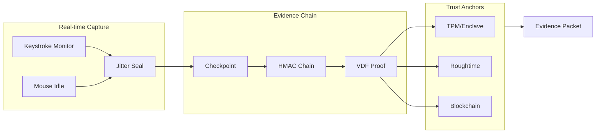

<p align="center">
  
</p>

<p align="center">
  <strong>Cryptographic authorship witnessing for writers and creators</strong>
</p>

<p align="center">
  <a href="https://doi.org/10.5281/zenodo.18480372"></a>
  <a href="https://arxiv.org/abs/2602.01663"></a>
  <a href="https://orcid.org/0009-0003-1849-2963"></a>
</p>

<p align="center">
  <a href="https://github.com/writerslogic/witnessd/actions"></a>
  <a href="https://github.com/writerslogic/witnessd/actions/workflows/release.yml"></a>
  <a href="https://slsa.dev/spec/v1.0/levels#build-l3"></a>
  <a href="https://github.com/writerslogic/witnessd/releases"></a>
  
</p>

<p align="center">
  
  
</p>

<p align="center">
  <a href="https://github.com/writerslogic/witnessd/blob/main/LICENSE"></a>
  
</p>

<p align="center">
  <a href="#installation">Installation</a> •
  <a href="#quick-start">Quick Start</a> •
  <a href="#how-it-works">How It Works</a> •
  <a href="#features">Features</a> •
  <a href="#citation">Citation</a>
</p>

---

> [!NOTE]
> **Patent Pending:** USPTO Application No. 19/460,364 — *"Falsifiable Process Evidence via Cryptographic Causality Locks and Behavioral Attestation"*

---

## Overview

**witnessd** produces independently verifiable, tamper-evident process evidence that constrains when and how a document could have been created, enabling adversarial review without relying on content analysis or trust in the recorder.

Faking it requires **more effort, more time, and more risk** than simply doing the work honestly — and any shortcut leaves detectable inconsistencies.

| Capability | Description |
|:-----------|:------------|
| **Prove authorship** | Cryptographic evidence chain linking you to your work |
| **Detect AI content** | Forensic analysis identifies non-human writing patterns |
| **Hardware-backed** | TPM 2.0 and Secure Enclave integration for device binding |
| **Verify independently** | Evidence can be verified by anyone, anywhere |

## Installation

### Package Managers

| Platform | Command |
|:---------|:--------|
| **macOS** | `brew install writerslogic/tap/witnessd` |
| **Linux** | `brew install writerslogic/tap/witnessd` |
| **Windows** | `scoop bucket add witnessd https://github.com/writerslogic/scoop-bucket && scoop install witnessd` |

### Quick Install Script

```bash
curl -sSf https://raw.githubusercontent.com/writerslogic/witnessd/main/install.sh | sh
```

<details>
<summary><strong>Manual Installation</strong></summary>

#### Direct Download

Download the appropriate binary from [GitHub Releases](https://github.com/writerslogic/witnessd/releases/latest):

| Platform | Architecture | Download |
|:---------|:-------------|:---------|
| Linux | x86_64 | `witnessd_*_x86_64-unknown-linux-gnu.tar.gz` |
| Linux | ARM64 | `witnessd_*_aarch64-unknown-linux-gnu.tar.gz` |
| macOS | Apple Silicon | `witnessd_*_aarch64-apple-darwin.tar.gz` |
| macOS | Intel | `witnessd_*_x86_64-apple-darwin.tar.gz` |
| Windows | x86_64 | `witnessd_*_x86_64-pc-windows-msvc.zip` |

```bash
# Example: Linux x86_64
tar -xzf witnessd_*.tar.gz && sudo mv witnessd-cli /usr/local/bin/witnessd
```

#### Build from Source

```bash
git clone https://github.com/writerslogic/witnessd && cd witnessd/rust/witnessd-cli
cargo build --release && sudo cp target/release/witnessd-cli /usr/local/bin/witnessd
```

</details>

<details>
<summary><strong>Verify Release Artifacts (SLSA)</strong></summary>

All releases include SHA256 checksums, SLSA Level 3 provenance attestations, and SBOMs.

```bash
# Install slsa-verifier
go install github.com/slsa-framework/slsa-verifier/v2/cli/slsa-verifier@latest

# Verify provenance
slsa-verifier verify-artifact witnessd_*.tar.gz \
  --provenance-path multiple.intoto.jsonl \
  --source-uri github.com/writerslogic/witnessd
```

</details>

## Quick Start

```bash
witnessd init                              # Initialize witnessd
witnessd calibrate                         # Calibrate VDF for your machine
witnessd commit document.md -m "Draft"     # Create checkpoint
witnessd log document.md                   # View history
witnessd export document.md -t enhanced    # Export as JSON
witnessd export document.md -f war -o proof.war  # Export as WAR block
witnessd verify evidence.json              # Verify JSON packet
witnessd verify proof.war                  # Verify WAR block

# Or verify online without installing:
# https://writerslogic.com/verify
```

## How It Works



> [!TIP]
> **Jitter seals** embed imperceptible microsecond delays (derived from HMAC) into your typing rhythm. These seals are cryptographically bound to document content — any tampering breaks the chain.[^1]

### Evidence Tiers

| Tier | Contents | Use Case |
|:-----|:---------|:---------|
| **Basic** | Checkpoint chain, VDF proof, declaration | Personal records |
| **Standard** | + Presence verification | Professional work |
| **Enhanced** | + Forensic analysis, keystroke patterns | Legal evidence |
| **Maximum** | + Hardware attestation, external anchors | Litigation-ready |

### Export Formats

| Format | Extension | Description |
|:-------|:----------|:------------|
| **JSON** | `.json` | Machine-readable evidence packet (default) |
| **WAR** | `.war` | ASCII-armored block (human-readable, email-safe) |

> [!NOTE]
> **WAR/1.1** blocks use entangled VDF computation where each checkpoint's time proof is cryptographically bound to accumulated keystroke jitter, making parallel precomputation impossible.

### Standards & Registrations

| Registry | Identifier | Description |
|:---------|:-----------|:------------|
| **IANA PEN** | 65074 | Private Enterprise Number (WritersLogic) |
| **CBOR Tag** | 1463894560 (0x57415220) | Writers Authenticity Report (.war) |
| **CBOR Tag** | 1347571280 (0x50505020) | Proof of Process Packet (.pop) |
| **CBOR Tag** | 1347571281 (0x50505021) | Compact Evidence Reference |
| **MIME Type** | `vnd.writerslogic.pop+cbor` | Proof of Process Packet |
| **MIME Type** | `vnd.writerslogic.war+cbor` | Writers Authenticity Report |

> [!NOTE]
> The Proof of Process specification has been submitted to the IETF RATS Working Group as Internet-Drafts: [draft-condrey-rats-pop](https://datatracker.ietf.org/doc/draft-condrey-rats-pop/) (core), [draft-condrey-rats-pop-schema](https://datatracker.ietf.org/doc/draft-condrey-rats-pop-schema/) (CDDL schema), and [draft-condrey-rats-pop-examples](https://datatracker.ietf.org/doc/draft-condrey-rats-pop-examples/) (implementation examples).

## Features

<details>
<summary><strong>Cryptographic Checkpointing</strong></summary>

- SHA-256 content hashing with HMAC chain integrity
- Unbreakable checkpoint chain — any modification invalidates subsequent proofs
- Merkle Mountain Range (MMR) for efficient verification

</details>

<details>
<summary><strong>Verifiable Delay Functions</strong></summary>

- Pietrzak VDF implementation proving minimum elapsed time
- Hardware-calibrated iterations (auto-tuned during `witnessd calibrate`)
- Prevents backdating — computation *must* take the claimed time

</details>

<details>
<summary><strong>Forensic Analysis</strong></summary>

- **Edit topology** — Insertion/deletion patterns across document regions
- **Keystroke cadence** — Inter-key interval distributions unique to individuals
- **Monotonic append detection** — Flags AI-generated content (sequential writes only)
- **Session gap analysis** — Identifies unnatural pauses or time manipulation

</details>

<details>
<summary><strong>Hardware Security</strong></summary>

| Platform | Hardware | Capability |
|:---------|:---------|:-----------|
| Windows/Linux | TPM 2.0 | Device binding, monotonic counters |
| macOS | Secure Enclave | Device binding, key attestation |

</details>

## Architecture

```
witnessd/
├── rust/
│   ├── witnessd-core/          # Cryptographic core library
│   │   ├── checkpoint.rs       # Document checkpointing
│   │   ├── vdf/                # Verifiable delay functions
│   │   ├── forensics.rs        # Authorship analysis
│   │   ├── platform/           # OS-specific capture (keys, mouse)
│   │   ├── tpm/                # Hardware security modules
│   │   └── evidence.rs         # Evidence export/verify
│   └── witnessd-cli/           # Command-line interface
└── platforms/                  # Native apps (coming soon)
```

## Security

> [!IMPORTANT]
> witnessd provides **independently verifiable, tamper-evident process evidence**, not absolute proof. A kernel-level adversary with complete system control can defeat any software-based attestation. The value lies in converting unsubstantiated doubt into testable claims across independent trust boundaries.[^1]

| Artifact | Attestation |
|:---------|:------------|
| Binaries | SLSA v1.0 Level 3 provenance |
| Dependencies | Vendored + `Cargo.lock` |
| SBOMs | SPDX + CycloneDX |

See [SECURITY.md](SECURITY.md) and [docs/SLSA.md](docs/SLSA.md) for details.

## Development

```bash
cd rust/witnessd-core
cargo test --all-features      # Run tests
cargo clippy -- -D warnings    # Lint
cargo fmt --all                # Format
cargo audit && cargo deny check # Security audit
```

## Citation

If you use witnessd in academic work, please cite:

```bibtex
@article{condrey2026witnessd,
  title={Witnessd: Proof-of-process via Adversarial Collapse},
  author={Condrey, David},
  journal={arXiv preprint arXiv:2602.01663},
  year={2026},
  doi={10.48550/arXiv.2602.01663}
}

@software{condrey2026witnessd_zenodo,
  title={Witnessd: Proof-of-Process Architecture for Document Authorship Verification},
  author={Condrey, David},
  year={2026},
  version={0.1.6},
  publisher={Zenodo},
  doi={10.5281/zenodo.18480372}
}
```

> **Abstract:** Digital signatures prove key possession but not authorship. We introduce *proof-of-process* — a mechanism combining jitter seals (imperceptible HMAC-derived timing), Verifiable Delay Functions, timestamp anchors, keystroke validation, and optional hardware attestation. The system converts unsubstantiated doubt into testable, falsifiable claims.
>
> — [arXiv:2602.01663](https://arxiv.org/abs/2602.01663) [cs.CR] • [Zenodo](https://doi.org/10.5281/zenodo.18480372)

## License

Licensed under the [Apache License, Version 2.0](LICENSE). See [LICENSE](LICENSE) for details.

## Links

[Documentation](https://docs.writerslogic.com/witnessd) • [SLSA Compliance](docs/SLSA.md) • [Evidence Format Spec](specs/evidence-format.md) • [Contributing](CONTRIBUTING.md)

---

[^1]: Condrey, D. (2026). *Witnessd: Proof-of-process via Adversarial Collapse*. arXiv:2602.01663. https://doi.org/10.48550/arXiv.2602.01663

[^2]: Condrey, D. (2026). *Witnessd: Proof-of-Process Architecture for Document Authorship Verification* (0.1.6). Zenodo. https://doi.org/10.5281/zenodo.18480372
